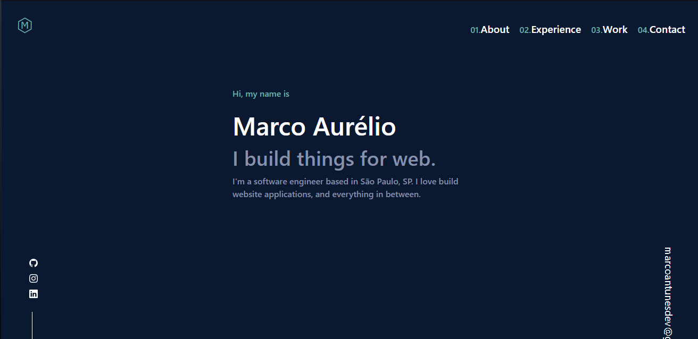

# Porifolio



> This site serves as my portfolio where I will aggregate all projects and my contacts as well as other information in the future.

### Adjust and enchancement

This project is not done yet, still dev and want add some features like:

- [ ] Add more info like photo

## 💻 Pré-requisites

Before you run, check if you attend to requisites below:
* You have the latest version of `<nodejs / npm>`
* You have installed all dependencies with npm `<npm install>`
* You have a `<Windows / Linux / Mac>` machine.

## 🚀 Instaling <Porifolio>

To install <Porifolio>, follow this steps:

Windows:
Clone repository:
```
on aplication folder, open console and type:
<npm install>
```

## ☕ Using <Porifolio>

To use <Porifolio>, follow this steps:

```
on aplication folder, open console and type:
<npm run dev / npm run build && npm start>
```

[⬆ Back to top](#Portifolio)<br>
